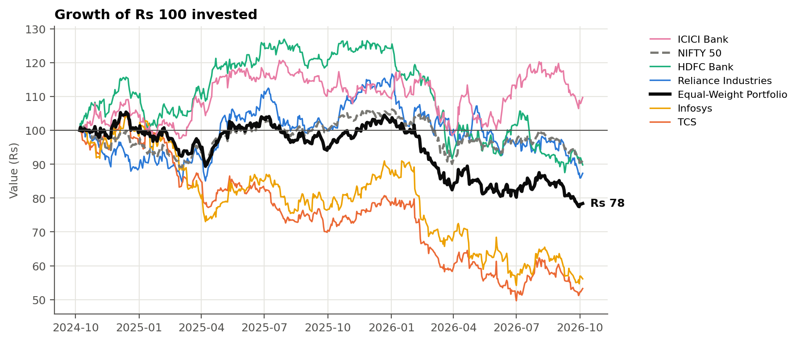

# Portfolio Performance & Risk Analyzer

A Python tool that measures the historical performance and risk of an equal-weight portfolio of five NSE large-cap stocks, explains where the risk comes from, and produces a PDF report from real market data in one command.

**Stocks:** Reliance Industries, TCS, HDFC Bank, Infosys, ICICI Bank (20% each)
**Benchmark:** NIFTY 50
**Data:** 2 years of daily adjusted prices from Yahoo Finance

## Problem statement

Anyone reporting on a portfolio has to answer three questions:

1. Did the portfolio make money, and how did it compare with the market?
2. Was the return worth the risk taken?
3. Is the portfolio as diversified as its holdings suggest, and which holdings drive its risk?

Total return only answers the first. This project adds volatility, the Sharpe Ratio, maximum drawdown, beta, a correlation matrix and covariance-based risk contribution so all three can be answered from the same dataset.

## Features

- Downloads daily adjusted prices from Yahoo Finance and saves the raw file with a download timestamp, so results can be reproduced and checked
- Cleans the data (duplicates, holidays, short gaps) and logs every change
- Builds an equal-weight portfolio and a buy-and-hold comparison
- Computes cumulative return, CAGR, annualised volatility, Sharpe Ratio, maximum drawdown and beta for every stock, the portfolio and the NIFTY 50
- Correlation matrix, diversification ratio, and each stock's share of portfolio risk
- Sharpe Ratio sensitivity to the risk-free rate
- Five charts, CSV tables, a 6-page PDF report, and findings whose wording is generated from the numbers
- A Jupyter notebook that repeats every calculation step by step and checks it against the project code
- Unit tests on small examples that can be verified with a calculator

## Dataset

| Item | Detail |
|---|---|
| Source | [Yahoo Finance](https://finance.yahoo.com/) through the [yfinance](https://pypi.org/project/yfinance/) package |
| Tickers | `RELIANCE.NS`, `TCS.NS`, `HDFCBANK.NS`, `INFY.NS`, `ICICIBANK.NS`, `^NSEI` |
| Field | Daily close adjusted for dividends and splits (`auto_adjust=True`) |
| Window | Most recent 2 years up to the run date (set `END_DATE` in `config.py` to freeze it) |
| Risk-free rate | 5.26%, the 91-day T-Bill cut-off yield at the RBI auction of 2 Sep 2026 ([source](https://mutualfund.adityabirlacapital.com/-/media/knowledgecenter/pdf/daily-fixed-income-tracker-03-sep-2026.pdf)) |

The raw download is saved to `data/prices_raw.csv` with its metadata in `data/prices_raw_info.json`.

## Methodology

1. **Clean** the price table: sort, remove duplicate dates, drop dates with no prices, fill gaps of up to 2 days with the last price, drop dates that still have gaps, reject non-positive prices.
2. **Daily returns:** `r_t = P_t / P_(t-1) - 1`.
3. **Portfolio return:** weighted sum of stock returns with 20% weights, reset every day.
4. **Metrics** for each stock, the portfolio and the NIFTY 50.
5. **Diversification:** correlation matrix, weighted average volatility versus actual portfolio volatility.
6. **Risk contribution:** split portfolio volatility into each stock's part using the covariance matrix.
7. **Report:** charts, tables and data-driven findings written to `outputs/`.

## Metrics explained

| Metric | Formula | Plain meaning |
|---|---|---|
| Cumulative return | product of (1 + r) - 1 | Total gain or loss over the period |
| CAGR | (1 + cumulative)^(252 / N) - 1 | The steady yearly return that gives the same end value |
| Annualised volatility | std(daily r) x sqrt(252) | How much returns typically swing in a year |
| Sharpe Ratio | mean(r - rf) / std(r) x sqrt(252) | Extra return over a risk-free T-Bill for each unit of risk |
| Maximum drawdown | min of (value / running peak - 1) | Worst fall from a previous high |
| Beta | cov(r, market) / var(market) | Average move for a 1% move in the NIFTY 50 |
| Correlation | cov(a, b) / (std a x std b) | How closely two stocks move together, from -1 to +1 |
| Diversification ratio | weighted average volatility / portfolio volatility | 1.0 means no diversification benefit |
| Risk contribution | w_i x (Cov w)_i / portfolio volatility | Share of portfolio risk caused by each stock |

252 is the market convention for trading days in a year. Volatility scales with the square root of time because variance, not standard deviation, adds up across independent days.

## Technologies

Python 3.9+, pandas, NumPy, Matplotlib, yfinance, ReportLab, Jupyter, pytest.

## How to run

```bash
git clone <your-repo-url>
cd portfolio-risk-analyzer
pip install -r requirements.txt

python main.py                   # download latest 2 years, analyse, write everything to outputs/
python main.py --end 2026-09-30  # fix the end date so the numbers never change
python main.py --offline         # re-run on the saved data/prices_raw.csv, no internet
python main.py --rf 0.065        # try a different risk-free rate

jupyter notebook Portfolio_Analysis.ipynb   # step-by-step walkthrough
python -m pytest -q                         # unit tests
```

**Google Colab:** upload the project folder, then run `!pip install -q reportlab` and `!python main.py` in a cell.

### Outputs

| File | Contents |
|---|---|
| `outputs/Portfolio_Risk_Report.pdf` | 6-page project report |
| `outputs/summary_metrics.csv` | All metrics for every security |
| `outputs/correlation_matrix.csv` | Pairwise correlations |
| `outputs/risk_contribution.csv` | Weight, share of risk, return contribution |
| `outputs/sharpe_sensitivity.csv` | Sharpe Ratio at several risk-free rates |
| `outputs/daily_returns.csv`, `prices_clean.csv` | Intermediate data |
| `outputs/results.json` | Diversification stats, drawdown dates, cleaning log |
| `outputs/charts/*.png` | The five charts |
| `outputs/resume_and_talking_points.md` | Resume bullets and interview answers filled in with this run's numbers |

## Sample results

<!-- RESULTS:START -->
_Data: 7 Oct 2024 to 5 Oct 2026, 500 trading days. Risk-free rate 5.26%. Generated by `python main.py`._

| Security | Cumulative return | CAGR | Volatility | Sharpe | Max drawdown |
|---|---:|---:|---:|---:|---:|
| Reliance Industries | -12.7% | -6.6% | 20.6% | -0.48 | -26.3% |
| TCS | -46.7% | -27.2% | 24.8% | -1.36 | -52.7% |
| HDFC Bank | -10.2% | -5.3% | 19.7% | -0.44 | -31.0% |
| Infosys | -43.9% | -25.3% | 28.0% | -1.09 | -48.2% |
| ICICI Bank | 9.7% | 4.8% | 18.4% | 0.07 | -18.4% |
| **Equal-Weight Portfolio** | -21.6% | -11.6% | 15.0% | -1.08 | -26.5% |
| NIFTY 50 | -9.0% | -4.7% | 13.0% | -0.70 | -15.2% |



### Key insights

1. **Performance.** Between 7 Oct 2024 and 5 Oct 2026 (500 trading days) the equal-weight portfolio lost 21.6% in total, an annualised return (CAGR) of -11.6%. Over the same days the NIFTY 50 returned -9.0%, so the portfolio underperformed the index by 12.6 percentage points.
2. **Risk-adjusted return.** Annualised volatility was 15.0% and the Sharpe Ratio was -1.08 using a 5.26% risk-free rate. A negative Sharpe Ratio means the portfolio earned less than a risk-free Treasury Bill over this period. The NIFTY 50's Sharpe Ratio was -0.70. When both ratios are negative, ranking them is not meaningful, because a negative ratio looks less bad simply when volatility is higher; compare total return and drawdown instead.
3. **Stock comparison.** ICICI Bank had the highest annualised return (4.8%) and TCS the lowest (-27.2%). Infosys was the most volatile stock (28.0%) and ICICI Bank the least (18.4%). ICICI Bank also had the best Sharpe Ratio (0.07).
4. **Diversification benefit.** If the five stocks had moved in perfect lockstep, portfolio volatility would have been 22.3% (the weighted average of the stocks). The actual figure was 15.0%, so diversification removed 32.6% of risk (diversification ratio 1.48). The average correlation between pairs of stocks was 0.30.
5. **Concentration.** The most correlated pair was TCS and Infosys (0.74); the least correlated was Infosys and ICICI Bank (0.13). TCS and Infosys are both Information Technology stocks. Sector weights are Banking 40%, Information Technology 40%, Energy & Conglomerate 20%, so five holdings span only 3 sectors. Stocks from the same sector react to the same news, which limits how much risk an equal-weight split can diversify away.
6. **Risk contribution.** Every stock holds a 20% weight, but risk is not split equally. Infosys accounted for 28.2% of portfolio volatility, the largest share relative to its weight, while ICICI Bank accounted for 13.6%.
7. **Drawdown.** The worst peak-to-trough fall was 26.5%, from 13 Dec 2024 to 30 Sep 2026. The portfolio had not regained that previous high by the end of the period. The NIFTY 50's maximum drawdown was 15.2%.
8. **Rebalancing.** The main results assume the portfolio is reset to 20% per stock every day. A buy-and-hold investor who never rebalanced would have had a total return of -20.8%, 0.8 percentage points higher than the rebalanced portfolio. Without rebalancing, weights drift towards whichever stocks have risen, so the two approaches carry different risk over time.
<!-- RESULTS:END -->

## Project structure

```
portfolio-risk-analyzer/
├── config.py                 # every assumption in one place
├── analytics.py              # data loading, cleaning and all calculations
├── charts.py                 # the five charts
├── insights.py               # findings written from the numbers
├── report.py                 # PDF report
├── main.py                   # runs everything
├── Portfolio_Analysis.ipynb  # step-by-step notebook
├── tests/test_metrics.py     # unit tests
├── INTERVIEW_PREP.md         # questions, answers and finance concepts
├── data/                     # raw downloaded prices
└── outputs/                  # generated tables, charts and report
```

## Limitations

- Historical results describe one two-year period and do not predict future returns.
- Correlations change over time and tend to rise in market stress.
- Five stocks from three sectors is a concentrated portfolio.
- Transaction costs, taxes and rebalancing costs are ignored.
- Volatility and the Sharpe Ratio treat upside and downside moves alike.
- One recent T-Bill yield is used for the whole period (see the sensitivity table).

## Possible future improvements

- Compare equal weights with risk-parity weights (equal share of risk per stock)
- Rolling 60-day volatility and correlation to show how risk changed over time
- Downside measures such as the Sortino Ratio and historical Value at Risk
- Use the average T-Bill yield over the period instead of a single value
- Add stocks from less correlated sectors and measure the change in diversification
- Include transaction costs to compare daily, monthly and no rebalancing

## Disclaimer

Academic project. Not investment advice.
